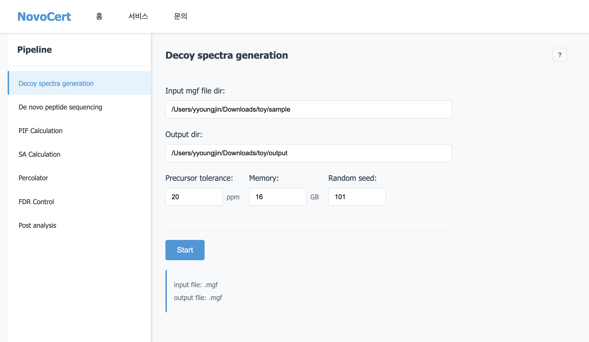

# NovoCert_FG_202502

## 작성자 정보
- **이름**: Youngjin Noh (노영진)
- **학번**: 2021097474
- **소속**: Hanyang University
- **전공**: Computer Science

## 기술 스택
- **Backend**: Flask (Python)
- **Frontend**: HTML, CSS, JavaScript
- **패키지 관리**: uv
- **아키텍처**: Factory Pattern + MVC

## 프로젝트 구조
```
NovoCertProject/
├── app/
│   ├── __init__.py          # Flask 앱 팩토리
│   ├── routes.py            # 라우트 정의
│   ├── models/              # MVC Model (데이터 모델)
│   │   └── __init__.py     # 모델 정의 예정
│   ├── controllers/         # MVC Controller (비즈니스 로직)
│   │   └── __init__.py     # 컨트롤러 정의 예정
│   ├── templates/
│   │   ├── base.html        # 기본 템플릿
│   │   ├── index.html       # 메인 페이지
│   │   ├── service.html     # 서비스 페이지
│   │   ├── components/      # 재사용 컴포넌트
│   │   │   ├── header.html
│   │   │   └── sidebar.html
│   │   └── services/        # 서비스별 템플릿
│   │       ├── decoy.html
│   │       ├── denovo.html
│   │       ├── fdr.html
│   │       ├── percolator.html
│   │       ├── pif.html
│   │       ├── post.html
│   │       └── sa.html
│   └── static/              # 정적 파일들
│       ├── css/
│       │   ├── style.css    # 메인 스타일
│       │   └── service.css  # 서비스 페이지 스타일
│       ├── js/
│       │   └── service.js   # 서비스 페이지 스크립트
│       └── images/          # 이미지 파일들 (비어있음)
├── config.py                # 설정 관리
├── extensions.py            # Flask 확장 (SQLAlchemy)
├── instance/                # 인스턴스 폴더 (데이터베이스 등)
│   ├── novocert.db         # SQLite 데이터베이스
│   └── backups/            # 백업 폴더 (비어있음)
├── pipelines/               # 파이프라인 실행 파일들
│   ├── decoy/              # Decoy 스펙트라 생성
│   ├── denovo/             # De novo 펩타이드 시퀀싱
│   ├── fdr/                # FDR 계산
│   ├── percolator/         # Percolator 재점수화
│   ├── pif/                # PIF 계산
│   ├── post/               # 후처리
│   └── sa/                 # SA 계산
├── pyproject.toml          # uv 의존성 관리
├── uv.lock                 # uv 잠금 파일
├── requirements.txt         # pip 의존성 (호환성)
├── run.py                  # Flask 앱 실행 파일
├── .gitignore              # Git 무시 파일
└── README.md               # 프로젝트 문서
```

## 설치 및 실행 방법

### 1. 프로젝트 클론
```bash
git clone https://github.com/BISCodeRepo/NovoCert_FG_202502.git
cd NovoCert_FG_202502
```

### 2. uv 설치 (macOS)
```bash
# Homebrew를 사용한 설치
brew install uv
```

### 3. 의존성 설치 및 가상환경 생성
```bash
# 프로젝트 초기화 (처음 한 번만)
uv init

# 의존성 설치 및 가상환경 생성
uv sync
```

### 4. 애플리케이션 실행
```bash
# 개발 모드로 실행
uv run python run.py
```

### 5. 브라우저에서 확인
웹 브라우저에서 `http://localhost:5000`으로 접속하여 애플리케이션을 확인할 수 있습니다.

